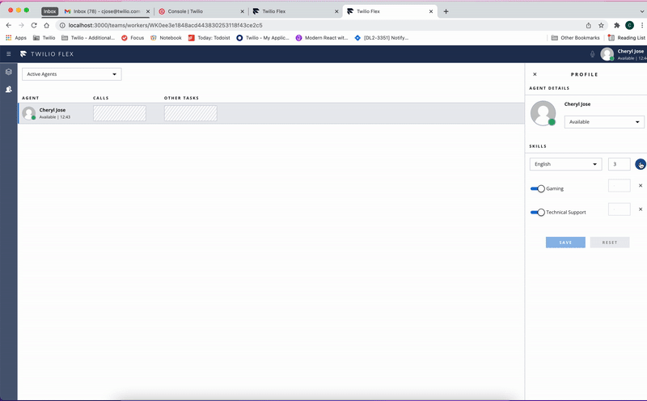

<a href="https://www.twilio.com">

</a>

# Twilio Flex Plugin - Skills Updated

Twilio Flex Plugins allow you to customize the appearance and behavior of [Twilio Flex](https://www.twilio.com/flex). If you want to learn more about the capabilities and how to use the API, check out our [Flex documentation](https://www.twilio.com/docs/flex).

This plugin will display a notification if the skills of an agent are changed.


Sample demo is provided below :

The notification will be displayed anytime the skill of an agent is updated as shown below :



## Requirements

To deploy this plugin, you will need:

- An active Twilio account with Flex provisioned. Refer to the [Flex Quickstart](https://www.twilio.com/docs/flex/quickstart/flex-basics#sign-up-for-or-sign-in-to-twilio-and-create-a-new-flex-project") to create one.
- npm version 5.0.0 or later installed (type `npm -v` in your terminal to check)
- Node.js [long term support(LTS) version](https://nodejs.org/en/about/releases/)(type `node -v` in your terminal to check)


## Setup

Make sure you have [Node.js](https://nodejs.org) as well as [`npm`](https://npmjs.com) installed.

1. Clone this repo:

  ```bash
  https://github.com/twilio-professional-services/plugin-updated-agent-skills.git
  ```

2. Go to the plugin directory

  ```bash
  cd plugin-updated-agent-skills
  ```

3. Install the dependencies

  ```bash
  # Install the dependencies of the Flex Plugin
  npm install
  ```

4. Run plugin on a local environment using :

  ```bash
  # Run the plugin on your local environment
  npm start
  ```

5. Deploy your plugin using :

  ```bash
  # Deply the plugin to your actual flex environment
  npm run deploy
  ```
